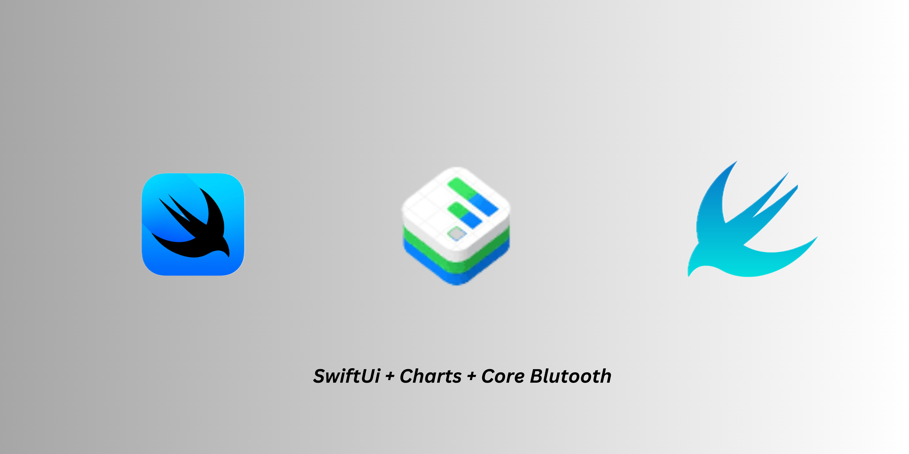
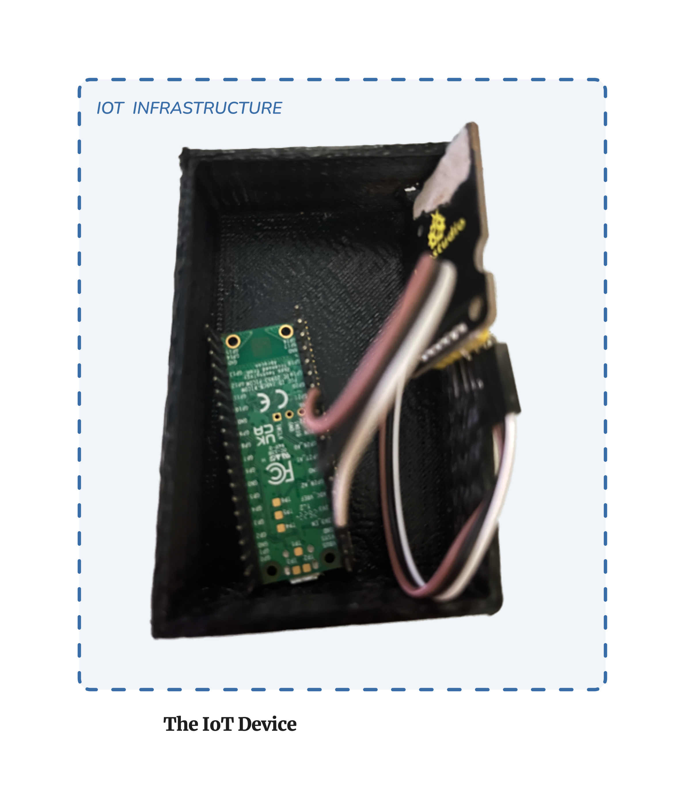

 

  

  <h3 align="center">SwiftUi ECG Data Visualization from CoreBluetooth</h3>

  

    An Awesome usage of SwiftUI charts and Also Visualization of Live ECG Data from sensor !!
     
     
  

    

## About The Project

This is a SwiftUI-based iOS application that reads ECG (Electrocardiogram) data from a Bluetooth Low Energy (BLE) peripheral device and displays it in real-time using a line chart.

The objective of this project is to explore how a device connected via CoreBluetooth can control an iOS system in the background without the need for any dedicated mobile applications. By leveraging the capabilities of Bluetooth Low Energy (BLE) and the CoreBluetooth framework on iOS, we aim to establish communication between a BLE peripheral device, such as a Raspberry Pi Pico running MicroPython, and an iOS device.

### Key Goals:

1. **Bluetooth Low Energy (BLE) Communication**: Establish a stable and reliable BLE connection between the iOS device and the peripheral device (e.g., Raspberry Pi Pico).

2. **Background Operation**: Enable the iOS device to receive and process data from the peripheral device even when the application is running in the background or when the device is locked.

3. **Control Mechanism**: Implement a control mechanism where actions initiated by the peripheral device can trigger responses or actions on the iOS device, such as displaying notifications, changing system settings, or performing specific tasks.

4. **Learning Experience**: Use this project as an opportunity to learn and understand the capabilities and limitations of CoreBluetooth, background execution modes, and BLE communication protocols on iOS.

### Expected Outcomes:

- Gain practical experience in developing iOS applications that communicate with external devices over BLE.
- Understand the principles of background execution and background processing on iOS.
- Explore possibilities for integrating IoT (Internet of Things) devices with iOS systems for remote control and automation.
- Document insights, challenges, and solutions encountered during the development process for future reference and knowledge sharing.

## Built With

- **SwiftUI**: SwiftUI is Apple's modern UI framework for building user interfaces across all Apple platforms.
- **CoreBluetooth**: CoreBluetooth is the framework used for interacting with Bluetooth Low Energy (BLE) devices.
- **SwiftUICharts**: SwiftUICharts is a SwiftUI library used for creating charts and graphs in SwiftUI-based applications.
- **MicroPython**: MicroPython is a lean and efficient implementation of the Python 3 programming language that is optimized to run on microcontrollers and embedded systems.

## Getting Started

### Prerequisites

Before getting started, make sure you have the following prerequisites installed:

1. **Xcode**: You'll need Xcode 12.0 or later installed on your macOS system. You can download Xcode from the [Mac App Store](https://apps.apple.com/us/app/xcode/id497799835?mt=12) or from the [Apple Developer website](https://developer.apple.com/xcode/).

2. **iOS Device**: You'll need an iOS device running iOS 14.0 or later to run the application. You can use an iPhone or iPad for testing.

3. **Bluetooth Peripheral**: Prepare a Bluetooth Low Energy (BLE) peripheral device capable of transmitting ECG data. For example, you can use a Raspberry Pi Pico with MicroPython firmware for this purpose.

### Getting the Source Code

1. **Clone the repository**: Clone the SwiftUI Bluetooth LE ECG Readings repository to your local machine using Git: git clone https://github.com/your-username/swiftui-bluetooth-le-ecg-readings.git

### Building and Running the Project

1. **Connect your iOS device**: Connect your iOS device to your computer using a USB cable.

2. **Select the target device**: In Xcode, select your iOS device as the build target from the dropdown menu in the toolbar.

3. **Build and run the project**: Click the "Run" button in Xcode to build and run the project on your iOS device. For IoT run the code throught the IDE "Thonny". Make sure to use the micropython for this.

## Contributing

Contributions are what make the open source community such an amazing place to be learn, inspire, and create. Any contributions you make are **greatly appreciated**.
* If you have suggestions for adding or removing projects, feel free to [open an issue](https://github.com/intiserahmed/SwiftUI-ECG-Readings-PiPicoW/issues/new) to discuss it, or directly create a pull request after you edit the *README.md* file with necessary changes.
* Please make sure you check your spelling and grammar.
* Create individual PR for each suggestion.
* Please also read through the [Code Of Conduct](https://github.com/intiserahmed/SwiftUI-ECG-Readings-PiPicoW/blob/main/CODE_OF_CONDUCT.md) before posting your first idea as well.

### Creating A Pull Request

1. Fork the Project
2. Create your Feature Branch (`git checkout -b feature/AmazingFeature`)
3. Commit your Changes (`git commit -m 'Add some AmazingFeature'`)
4. Push to the Branch (`git push origin feature/AmazingFeature`)
5. Open a Pull Request

## License

Distributed under the MIT License. See [LICENSE](https://github.com/intiserahmed/SwiftUI-ECG-Readings-PiPicoW/blob/main/LICENSE.md) for more information.

## Authors

* **Intiser Ahmed** - *Comp Sci Student* - [Intiser Ahmed](https://github.com/intiserahmed/) 

